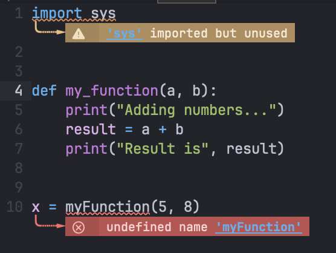

#+title: Doom Emacs Configuration
#+AUTHOR: James Patrick
#+SETUPFILE: ./dist/setup.org
#+TODO: TRAIL_RUN(t) REFACTOR_NEEDED(r) |
#+PROPERTY: header-args :mkdirp yes

This Emacs configuration is written in the style of [[https://en.wikipedia.org/wiki/Literate_programming][Literate Programming]] paradigm & using Hlissner's awesome [[https://github.com/doomemacs/doomemacs][Doom Emacs]] framework. I'll detail the "how" and "why" as I get a better figure out what the hell I'm doing. My current configuration is the result of trying to solidify a collection of outdated work around, snippets cribbed from Stack Overflow, ideas from folks smarter than I am, then held together with string & bubble gum. Please don't hesitate to tell me my elisp-fu sucks or if there's a better way to do anything. If you have any questions please let me know.

* Document Structure
** Doom Emacs
I'm utilizing Hlissner's [[https://github.com/doomemacs/doomemacs][Doom Emacs]] frameworks. Doom Emac's configuration is divided into 150 modules, & fair number of convenience functions. Rather than detailing stuff about I'll say to go read [[https://github.com/doomemacs/doomemacs/blob/master/docs/faq.org][FAQs]] & [[https://github.com/doomemacs/doomemacs/blob/f9664ae058d67b8d97cb8a9c40744fefc3e5479f/docs/getting_started.org][Getting Started]]. Also the [[https://github.com/doomemacs/doomemacs/blob/master/docs/index.org][Index]] if you want to be well informed.

Configuration is located in the ~$DOOMDIR~ directory; I'll be using =$XDG_HOME_DIR/doom= / =~/.config/doom=

** Tangle
This org-mode page works by using [[https://orgmode.org/manual/Extracting-Source-Code.html][tangles]]. Doom's literate config module adds any ~#+begin_src~ blocks into the =config.el= file[fn:1]. If you want to tangle to a specific file you pass in a file name.

#+begin_src org :tangle no
#+begin_src emacs-lisp :tangle "example.el"
#+end_src

or to disable it tangling for a code block set the =:tangle= property in code block header to =no=.

#+begin_src org :tangle no
#+begin_src orgmode :tangle no
#+end_src

*** No-Web Reference
This document also uses [[https://orgmode.org/manual/Noweb-Reference-Syntax.html][noweb reference syntax]] to try and DRY this doc out a little. For example

#+begin_example :tangle no
#+NAME: initialization
#+BEGIN_SRC emacs-lisp
  (setq sentence "Never a foot too far, even.")
#+END_SRC

#+BEGIN_SRC emacs-lisp :noweb yes
  <<initialization>>
  (reverse sentence)
#+END_SRC
#+end_example

will produce

#+begin_example
#+BEGIN_SRC emacs-lisp :noweb yes
  (setq sentence "Never a foot too far, even.")
  (reverse sentence)
#+END_SRC
#+end_example

** Files tree
There's a fair number of files located in ~$DOOMDIR~.  Some are configuration, some are additional tooling not use directly by emacs.

#+begin_src bash :tangle no :exports result :results output verbatim
tree $DOOMDIR -L 2
#+end_src

#+RESULTS:
#+begin_example
.
├── backup_init.el
├── config.d
│   ├── +keybinds.el
│   ├── +org.el
│   └── +ui.el
├── config.el
├── config.org
├── custom.el
├── dist
│   ├── bundle.js
│   ├── code.css
│   ├── custom.css
│   ├── setup.org
│   └── tufte.css
├── init.el
├── makefile
├── modules
│   ├── lang
│   └── tools
├── packages.el
└── snippets
    └── org-mode

8 directories, 17 files
#+end_example

*** Emacs Configuration Files
Doom has a lot of configuration has a lot of flexibility & a large number of doing things incorrectly. At its most basic there are 3 files create and used by default for your ~$DOOMDIR~.

+ =init.el= :: Enabled Doom Modules
+ =packages.el= :: Packages to fetch from MELPA, GitHub, etc.
+ =config.el= :: General Emacs configuration

In addition to these there exists the following special directories
+ =modules/= :: Custom modules. See [[https://github.com/doomemacs/doomemacs/blob/master/docs/getting_started.org#writing-your-own-modules][Writing your own modules]] for details. I recommend opting for this on the sooner side.
+ =autoload/= :: Functions instantiated very early.
+ =snippets/[major mode]/*= :: These are [[https://github.com/joaotavora/yasnippet][YASnippets]]. These are manage by this document. See [[*Snippets][Snippets]] for more.

*I've also added a non-standard ~$DOOMDIR/config.d~ directory. Any =.el= file added here will get automatically loaded as part of the =config.el= file.* See [[*Loading =$DOOMDIR/config.d=][Loading $DOOMDIR/config.d]] for the implementation.

Currently, this includes[fn:4]
- =+org.el= :: Additional configuration for Orgmode. Considering this is one of the primary modes I use emacs in there's a fair bit of configuration there.
- =+keybinds.el= ::  A relatively new and not fully utilized file. The plan is to use this as a centralized location for all custom key binds.
- =+ui.el= :: General Purpose UI changes.

We also have an additional backup_init.el file. This is used to stub in the =init.el= config with literate
*** Non-Doom Files
- =makefile= :: You know what makes a terrible alternative to things like [[https://www.gnu.org/software/stow/][stow]], [[https://github.com/yadm-dev/yadm][yadm]], or [[https://github.com/twpayne/chezmoi][chezmoi]]? Know what I'm using anyways?[fn:2]
- =dist/= :: These are files used by the output of [[https://github.com/ox-tufte/ox-tufte][ox-tufte]].[fn:3] TODO Move this to assets
- =.assets/= :: Images, CSS, Javascript, etc.
- =config.html= :: This org file exported from [[https://github.com/ox-tufte/ox-tufte][ox-tufte]]. This is not versioned.

**  =.el= file prefixing

There [[https://nullprogram.com/blog/2016/12/22/][minor but non-zero start time benefits]] for using lexical bindings comments. All files created should start with

#+name:lexical-binding
#+BEGIN_SRC emacs-lisp :tangle no
;;; -*- lexical-binding: t; -*-
#+END_SRC

Anytime we sync or save our =config.org= file we are going to clobber any tangled files. So lets remind ourselves about this foot gun.

#+name:modification-warning
#+begin_src emacs-lisp :tangle no
;;; This file is generated from config.org's tangles. Any modification will be
;;; clobbered on sync or save, make modifications to the config.org instead.
;;; Or don't. I'm a sign not a cop.
#+end_src

*** Applying to all files
We need to apply this to all the following files.

#+begin_src bash :tangle no :exports result :results output verbatim
FOO=${DOOMDIR:-${HOME}/.config/doom} find ${FOO}* -iname '*.el' | sed "s/^${FOO}//"
#+end_src

#+RESULTS:
#+begin_example
backup_init.el
config.d/+keybinds.el
config.d/+org.el
config.d/+ui.el
config.el
custom.el
init.el
modules/tools/llm/keybinds.el
modules/tools/llm/packages.el
modules/tools/llm/config.el
modules/lang/mermaid/packages.el
modules/lang/mermaid/package.el
modules/lang/mermaid/config.el
modules/lang/mermaid/doctor.el
packages.el
#+end_example

Since we've used a named these blocks we can use [[*No-Web Reference][No-Web Reference]] for all the files. Lets define a new section

#+name:elisp-header
#+begin_src emacs-lisp :tangle no :noweb no-export
<<lexical-binding>>
<<modification-warning>>
#+end_src

=config.el=
#+begin_src emacs-lisp :tangle "config.el" :noweb no-export :comments no
<<elisp-header>>
#+END_SRC

=init.el=
#+begin_src emacs-lisp :tangle "init.el" :noweb no-export :comments no
<<elisp-header>>
#+END_SRC

=packages.el=
#+begin_src emacs-lisp :tangle "packages.el" :noweb no-export :comments no
<<elisp-header>>
#+END_SRC

Then all of the files in =config.d=

=config.d/+ui.el=
#+begin_src emacs-lisp :tangle "config.d/+ui.el" :noweb no-export :comments no
<<elisp-header>>
#+END_SRC

=config.d/+keybinds.el=
#+begin_src emacs-lisp :tangle "config.d/+keybinds.el" :noweb no-export :comments no
<<elisp-header>>
#+END_SRC

=config.d/+org.el=
#+begin_src emacs-lisp :tangle "config.d/+org.el" :noweb no-export :comments no
<<elisp-header>>
#+END_SRC

** Loading =$DOOMDIR/config.d=
We want to load any =.el= file in the =config.d= directory, so lets use the following snippet.

#+begin_src emacs-lisp :tangle "config.el" :noweb no-export :comments no
(mapc (lambda (file)
        (load! file nil t))
      (directory-files (concat doom-user-dir "config.d") t "\\.el\\'"))
#+END_SRC

* Doom Modules
Doom's modules are enabled via the =init.el= file. I've parted this file out using noweb. If a module needs some tweak, or there some comments some part, it will be located there. This is based off a =init.example.el= pulled from [[https://github.com/doomemacs/doomemacs/blob/e6c755305358412a71a990fc2cf592c629edde1e/static/init.example.el][e6c7553]].

#+name: init.el
#+attr_html: :collapsed t
#+begin_src emacs-lisp :tangle "init.el" :noweb no-export :comments no
;; This file controls what Doom modules are enabled and what order they load
;; in. Remember to run 'doom sync' after modifying it!

;; NOTE Press 'SPC h d h' (or 'C-h d h' for non-vim users) to access Doom's
;;      documentation. There you'll find a link to Doom's Module Index where all
;;      of our modules are listed, including what flags they support.

;; NOTE Move your cursor over a module's name (or its flags) and press 'K' (or
;;      'C-c c k' for non-vim users) to view its documentation. This works on
;;
;;      Alternatively, press 'gd' (or 'C-c c d') on a module to browse its
;;      directory (for easy access to its source code).

(doom! :input
       <<doom-input>>

       :completion
       <<doom-completion>>

       :ui
       <<doom-ui>>

       :editor
       <<doom-editor>>

       :emacs
       <<doom-emacs>>

       :term
       <<doom-term>>

       :checkers
       <<doom-checker>>

       :tools
       <<doom-tools>>

       :os
       (:if (featurep :system 'macos) macos)  ; improve compatibility with macOS
       ;;tty               ; improve the terminal Emacs experience

       :lang
       <<doom-lang>>

       :email
       <<doom-email>>

       :app
       <<doom-app>>

       :config
       <<doom-config>>
)
#+end_src

** Input
https://github.com/doomemacs/doomemacs/tree/master/modules/input

This section is un-used by me but still worth keeping for reference

#+name:doom-input
#+begin_src emacs-lisp :tangle no
;;bidi              ; (tfel ot) thgir etirw uoy gnipleh
;;chinese
;;japanese
;;layout            ; auie,ctsrnm is the superior home row
#+end_src

** Completion
https://github.com/doomemacs/doomemacs/tree/master/modules/completion

#+name:doom-completion
#+begin_src emacs-lisp :tangle no
;;(company +childframe)           ; the ultimate code completion backend
(corfu +icons +orderless)  ; complete with cap(f), cape and a flying feather!
;;helm              ; the *other* search engine for love and life
;;ido               ; the other *other* search engine...
;;ivy               ; a search engine for love and life
(vertico +icons)          ; the search engine of the future
#+end_src

This is an example of something that should have auto-complete.

** UI
https://github.com/doomemacs/doomemacs/tree/master/modules/ui

#+name:doom-ui
#+begin_src emacs-lisp :tangle no
;;deft              ; notational velocity for Emacs
doom              ; what makes DOOM look the way it does
doom-dashboard    ; a nifty splash screen for Emacs
doom-quit         ; DOOM quit-message prompts when you quit Emacs
(emoji +unicode)  ; 🙂
hl-todo           ; highlight TODO/FIXME/NOTE/DEPRECATED/HACK/REVIEW
;;indent-guides     ; highlighted indent columns
;;ligatures         ; ligatures and symbols to make your code pretty again
;;minimap           ; show a map of the code on the side
modeline          ; snazzy, Atom-inspired modeline, plus API
nav-flash         ; blink cursor line after big motions
;;neotree           ; a project drawer, like NERDTree for vim
ophints           ; highlight the region an operation acts on
(popup +defaults)   ; tame sudden yet inevitable temporary windows
;;smooth-scroll     ; So smooth you won't believe it's not butter
tabs              ; a tab bar for Emacs
(treemacs +lsp)          ; a project drawer, like neotree but cooler
;;unicode           ; extended unicode support for various languages
(vc-gutter +pretty) ; vcs diff in the fringe
vi-tilde-fringe   ; fringe tildes to mark beyond EOB
;;window-select     ; visually switch windows
workspaces        ; tab emulation, persistence & separate workspaces
zen               ; distraction-free coding or writing
#+end_src

*** Fancy Welcome Image
Rather than the ascii doom logo. Lets use the Doom logo off the [[https://www.reddit.com/r/Doom/comments/1eu9cwy/a_look_at_all_the_doom_box_art_over_the_years/][original box art]]. This is enabled by the =doom-dashboard= module.

#+CAPTION:Doom Welcome Icon
[[./.resources/doom.png]]

#+begin_src emacs-lisp :tangle "config.d/+ui.el" :noweb no-export :comments no
(setq fancy-splash-image (concat doom-user-dir "./.resources/doom.png"))
#+end_src

** Editor
https://github.com/doomemacs/doomemacs/tree/master/modules/editor

#+name:doom-editor
#+begin_src emacs-lisp :tangle no
(evil +everywhere); come to the dark side, we have cookies
file-templates    ; auto-snippets for empty files
fold              ; (nigh) universal code folding
(format +onsave)  ; automated prettiness
;;god               ; run Emacs commands without modifier keys
;;lispy             ; vim for lisp, for people who don't like vim
;;multiple-cursors  ; editing in many places at once
;;objed             ; text object editing for the innocent
;;parinfer          ; turn lisp into python, sort of
rotate-text       ; cycle region at point between text candidates
snippets          ; my elves. They type so I don't have to
(whitespace +guess +trim)  ; a butler for your whitespace
;;word-wrap         ; soft wrapping with language-aware indent
#+end_src

*** Custom Formatter
Doom uses [[https://github.com/lassik/emacs-format-all-the-code][emacs-format-all-the-code]] for its formatting. It's a great package, but I don't always love the default option its decided on. Right now I'm only going to update it to use
At this time I'm only going to update =sql-mode= to use [[https://github.com/darold/pgFormatter][pgformatter]]. It's supported, but instead used by default.

#+begin_src emacs-lisp
(setq-hook! 'sql-mode-hook +format-with 'pgformatter)
#+end_src

It's also worth adding =nogrouping=0= to your =$XDG_CONFIG_HOME/pg_format/pg_format.conf= file. Everything should be wrapped in a transaction block. If you're wanting fall back points use checkpoints.

** Emacs
https://github.com/doomemacs/doomemacs/tree/master/modules/emacs

#+name:doom-emacs
#+begin_src emacs-lisp :tangle no
dired             ; making dired pretty [functional]
electric          ; smarter, keyword-based electric-indent
;;eww               ; the internet is gross
(ibuffer +icons)           ; interactive buffer management
;;tramp             ; remote files at your arthritic fingertips
(undo +tree)              ; persistent, smarter undo for your inevitable mistakes
vc                ; version-control and Emacs, sitting in a tree
#+end_src

** Term
https://github.com/doomemacs/doomemacs/tree/master/modules/term

#+name:doom-term
#+begin_src emacs-lisp :tangle no
;;eshell            ; the elisp shell that works everywhere
;;shell             ; simple shell REPL for Emacs
;;term              ; basic terminal emulator for Emacs
vterm             ; the best terminal emulation in Emacs
#+end_src

Vterm is great. It does require some additional configuration to work properly. See [[https://github.com/doomemacs/doomemacs/tree/master/modules/term/vterm][relevant doc]] for more.

** Checker
https://github.com/doomemacs/doomemacs/tree/master/modules/checker

#+name:doom-checker
#+begin_src emacs-lisp :tangle no
(syntax +childframe +icons +flymake)             ; tasing you for every semicolon you forget
(spell +aspell +everywhere) ; tasing you for misspelling mispelling
grammar           ; tasing grammar mistake every you make
#+end_src

*** Custom Dictionary
#+begin_src emacs-lisp :tangle "config.el" :noweb no-export :comments no
(setq ispell-dictionary "en"
      ispell-personal-dictionary (concat org-directory ".ispell.en.pws"))
#+end_src

** Tools
https://github.com/doomemacs/doomemacs/tree/master/modules/tools

#+name:doom-tools
#+begin_src emacs-lisp :tangle no
ansible
;;biblio            ; Writes a PhD for you (citation needed)
;;collab            ; buffers with friends
(debugger +lsp)          ; FIXME stepping through code, to help you add bugs
;;direnv
;;docker
;;editorconfig      ; let someone else argue about tabs vs spaces
;;ein               ; tame Jupyter notebooks with emacs
(eval +overlay)     ; run code, run (also, repls)
(lookup +dictionary +docset +offline)              ; navigate your code and its documentation
llm               ; Custom; when I said you needed friends, I didn't mean...
(lsp +peek)      ; M-x vscode
(magit +forge)             ; a git porcelain for Emacs
;;make              ; run make tasks from Emacs
;;pass              ; password manager for nerds
;;pdf               ; pdf enhancements
(terraform +lsp)         ; infrastructure as code
;;tmux              ; an API for interacting with tmux
tree-sitter       ; syntax and parsing, sitting in a tree...
;;upload            ; map local to remote projects via ssh/ftp
#+end_src

** Language
https://github.com/doomemacs/doomemacs/tree/master/modules/lang

#+name:doom-lang
#+begin_src emacs-lisp :tangle no
;;ada               ; In strong typing we (blindly) trust
;;agda              ; types of types of types of types...
;;beancount         ; mind the GAAP
;;(cc +lsp)         ; C > C++ == 1
;;clojure           ; java with a lisp
;;common-lisp       ; if you've seen one lisp, you've seen them all
;;coq               ; proofs-as-programs
;;crystal           ; ruby at the speed of c
;;csharp            ; unity, .NET, and mono shenanigans
data              ; config/data formats
;;(dart +flutter)   ; paint ui and not much else
;;dhall
;;elixir            ; erlang done right
;;elm               ; care for a cup of TEA?
emacs-lisp        ; drown in parentheses
;;erlang            ; an elegant language for a more civilized age
;;ess               ; emacs speaks statistics
;;factor
;;faust             ; dsp, but you get to keep your soul
;;fortran           ; in FORTRAN, GOD is REAL (unless declared INTEGER)
;;fsharp            ; ML stands for Microsoft's Language
;;fstar             ; (dependent) types and (monadic) effects and Z3
;;gdscript          ; the language you waited for
(go +lsp +tree-sitter)         ; the hipster dialect
;;(graphql +lsp)    ; Give queries a REST
;;(haskell +lsp)    ; a language that's lazier than I am
;;hy                ; readability of scheme w/ speed of python
;;idris             ; a language you can depend on
(json +lsp +tree-sitter)              ; At least it ain't XML
;;janet             ; Fun fact: Janet is me!
;;(java +lsp)       ; the poster child for carpal tunnel syndrome
(javascript +lsp +tree-sitter)        ; all(hope(abandon(ye(who(enter(here))))))
;;julia             ; a better, faster MATLAB
;;kotlin            ; a better, slicker Java(Script)
;;latex             ; writing papers in Emacs has never been so fun
;;lean              ; for folks with too much to prove
;;ledger            ; be audit you can be
;;lua               ; one-based indices? one-based indices
markdown          ; writing docs for people to ignore
mermaid           ; Custom. Graphviz++
;;nim               ; python + lisp at the speed of c
(nix +tree-sitter +lsp)               ; I hereby declare "nix geht mehr!"
;;ocaml             ; an objective camel
(org +dragndrop +journal +pandoc +pomodoro +pretty +roam)               ; organize your plain life in plain text
;;php               ; perl's insecure younger brother
;;plantuml          ; diagrams for confusing people more
;;graphviz          ; diagrams for confusing yourself even more
;;purescript        ; javascript, but functional
(python +lsp +poetry +pyright +tree-sitter)            ; beautiful is better than ugly
;;qt                ; the 'cutest' gui framework ever
;;racket            ; a DSL for DSLs
;;raku              ; the artist formerly known as perl6
;;rest              ; Emacs as a REST client
;;rst               ; ReST in peace
(ruby +rbenv +lsp +tree-sitting)     ; 1.step {|i| p "Ruby is #{i.even? ? 'love' : 'life'}"}
;;(rust +lsp)       ; Fe2O3.unwrap().unwrap().unwrap().unwrap()
;;scala             ; java, but good
;;(scheme +guile)   ; a fully conniving family of lisps
(sh +lsp +tree-sitter)                ; she sells {ba,z,fi}sh shells on the C xor
;;sml
;;solidity          ; do you need a blockchain? No.
;;swift             ; who asked for emoji variables?
;;terra             ; Earth and Moon in alignment for performance.
(web +lsp +tree-sitter)               ; the tubes
(yaml +lsp)              ; JSON, but readable
;;zig               ; C, but simpler
#+end_src

There's a lot there there here.

+ =org= :: I have so many tweaks for this it's its own section. See [[*OrgMode][OrgMode]] for more.

** Emails
https://github.com/doomemacs/doomemacs/tree/master/modules/email

#+name:doom-email
#+begin_src emacs-lisp :tangle no
;;(mu4e +org)
;;notmuch
;;(wanderlust +gmail)
#+end_src

** App
https://github.com/doomemacs/doomemacs/tree/master/modules/app

#+name:doom-app
#+begin_src emacs-lisp :tangle no
calendar
;;emms
 ;;everywhere        ; *leave* Emacs!? You must be joking
;;irc               ; how neckbeards socialize
;;(rss +org)        ; emacs as an RSS reader
#+end_src

** Config
https://github.com/doomemacs/doomemacs/tree/master/modules/config

#+name:doom-config
#+begin_src emacs-lisp :tangle no
literate
(default +bindings +smartparens)
#+end_src

* UI Tweaks
** Save Status
The title bar display string will display =♢= if there exist unsaved buffer modifications & =♦= otherwise.

#+begin_src emacs-lisp :tangle "config.d/+ui.el" :noweb no-export :comments no
(setq doom-fallback-buffer-name "Doom"
      +doom-dashboard-name "Doom Dashboard")

(setq frame-title-format
      '(""
        (:eval
         (if (s-contains-p org-roam-directory (or buffer-file-name ""))
             (replace-regexp-in-string
              ".*/[0-9]*-?" "☰ "
              (subst-char-in-string ?_ ?  buffer-file-name))
           "%b"))
        (:eval
         (let ((project-name (projectile-project-name)))
           (unless (string= "-" project-name)
             (format (if (buffer-modified-p)  " ♢ %s" " ♦ %s") project-name))))))
#+end_src

** Fonts
I use the [[https://www.jetbrains.com/lp/mono/][JetBrains Mono]] for my monospaced font & Huerta Tipografica's [[https://www.huertatipografica.com/en/fonts/alegreya-ht-pro][Alegreya]] serif font.

#+begin_src emacs-lisp :tangle "config.d/+ui.el" :noweb no-export :comments no
(setq
      doom-font (font-spec :family "JetBrains Mono" :size 12 :height 1)
      doom-variable-pitch-font (font-spec :family "Alegreya" :height 1.3)
      doom-big-font (font-spec :family "JetBrains Mono" :size 18))
#+end_src

** Window Size
I'm normally running a titling window manager so this is usually less of an issue, but the emacs window on start is often impractically small. Let's set it to something more reasonable.

#+begin_src emacs-lisp :tangle "config.d/+ui.el" :noweb no-export :comments no
(add-to-list 'default-frame-alist '(height . 64))
(add-to-list 'default-frame-alist '(width . 192))
#+end_src

** Better Linter Messaging
[[https://github.com/konrad1977/flyover?][Flyover]] is a more modern overlay for the flymake & flycheck linting systems in Emacs.

 #+CAPTION: Flyover Example

#+CAPTION: Flyover Example Source
#+begin_src python :tangle no :noweb no-export :comments no :results output silent
import sys

def my_function(  a, b ):
    print( 'Adding numbers...' )
    result = a +  b
    print( "Result is",result )

x = myFunction (5,8 )
#+end_src

#+begin_src emacs-lisp :tangle "packages.el" :noweb no-export :comments no :results output silent
(package! flyover)
#+end_src

We want to enable it with hooks for both flycheck & flymake. There is a lot of configuration settings. I'm just going pretty basic with minor tweaks to the colors & tints used.

#+begin_src emacs-lisp :tangle "config.d/+ui.el" :noweb no-export :comments no
(use-package flyover
  :ensure t
  :hook ((flycheck-mode . flyover-mode)
         (flymake-mode . flyover-mode))
  :custom
  (flyover-checkers '(flycheck flymake))
  (flyover-hide-during-completion t)
  ;; UI tweaks
  (flyover-use-theme-colors t)
  (flyover-text-tint 'lighter)
  (flyover-text-tint-percent 70)
  (flyover-icon-tint 'lighter)
  (flyover-icon-tint-percent 50)
  (flyover-icon-background-tint 'darker)
  (flyover-icon-background-tint-percent 30)
  )
#+end_src

* Projectile Project Search
I primarily keep my code either in =$HOME/Code= or nested inside =$HOME/Documents=. Let's have emacs check these directories
#+begin_src emacs-lisp :tangle "config.el" :noweb no-export :comments no
(setq projectile-project-search-path '("~/Code/" ("~/Documents" . 3)))
#+end_src

While the search is quick I don't think there is enough value in making this happening automatically on startup. As such I'm going to leave =projectile-auto-discover= & =projectile-cleanup-known-projects= as =nil=. Instead use the =projectile-discover-projects-in-search-path= to add projects & =projectile-cleanup-known-projects= to cleanup removed projects.

This part isn't needed but let's set these values as =nil=.
#+begin_src emacs-lisp :tangle "config.el" :noweb no-export :comments no
(setq projectile-auto-discover nil)
(setq projectile-cleanup-known-projects nil)
#+end_src

Further documentation on this can be found [[https://docs.projectile.mx/projectile/usage.html#automated-project-discovery][here]].

* Keybinds
I use Evil for most things, & most of Doom's defaults. I'm going to try and centralise keybinds in to the =$DOOMDIR/config.d/+keybinds.el=. This isn't always going to happen as the =use-package!= can be really helpful for setting up.

Doom ships with a =map!= macro (see [[https://github.com/doomemacs/doomemacs/blob/master/docs/faq.org#bind-my-own-keys-or-change-existing-ones][here]] for why).  Documentation for this can be found [[https://github.com/doomemacs/doomemacs/blob/master/docs/faq.org#bind-my-own-keys-or-change-existing-ones][here]], but in broad strokes:
1. Start with a =map!= macro.  You can use
2. When possible use =:when= to limit scope.
3. Use =:prefix= and =:prefix-map= where possible.
4. Always use =:desc= to describe what is being done.

Below is a sample snippet from Rameez Khan's [[https://rameezkhan.me/posts/2020/2020-07-03--adding-keybindings-to-doom-emacs/][blog]].
   #+begin_src emacs-lisp :tangle no
(map! :leader
      (:prefix-map ("a" . "applications")
                   (:prefix ("j" . "journal")
                    :desc "New journal entry" "j" #'org-journal-new-entry
                    :desc "Search journal entry" "s" #'org-journal-search)))
   #+end_src

** =whichkey= response time
By default which key has a delay of 1 second before it responds. Lets make it a little more responsive by halving that.

#+begin_src emacs-lisp :tangle "config.d/+keybinds.el" :noweb no-export :comments no
(setq which-key-idle-delay 0.5)
#+end_src

** Icons
I make liberal use of the =nerd-icons-insert= function. To make it a little more accessible I'm binding it to ~SPC i i~.

#+begin_src emacs-lisp :tangle "config.d/+keybinds.el" :noweb no-export :comments no
(map! :leader
      (:prefix "i"
       :desc "icons" "i" #'nerd-icons-insert
       )
      )
#+end_src

Its a little annoying to have to go through the leader key for this all the time. So lets also bind it to ~M-I~ (~SHIFT-META-i~) in insert mode.

#+begin_src emacs-lisp :tangle "config.d/+keybinds.el" :noweb no-export :comments no :results silent
(map! :i "M-I" #'nerd-icons-insert)
#+end_src

* OrgMode
OrgMode is ridiculous. It's a combination note taking, todo-list, jupyter notebook, & calendaring major-mode for Emacs. It is incredibly configurable and extendable, and feature rich to the degree that discovering spreadsheet support after using it for 6 months seems to be a rite of passage. It's wonderful and terrible in a lot of the ways emacs itself is. That said its one of the primary reasons I can't leave emacs.

I currently have my files synced via git (see [[*Syncing][Syncing]] for details). But I've yet to find a good mobile clients. I've bounced off [[https://logseq.com/][LogSeq]] multiple times. [[https://xenodium.com][xenodium's]] great [[https://xenodium.com/plain-org-for-ios][PlainOrg]], doesn't vibe well with a roam style setup. I'm tempted to build my own implementation ([[https://xkcd.com/927/][relevant XKCD]]), but given the small child & a growing list household projects, this isn't likely soon.

** Making Scripting a little easier.
Doom is pretty quick, but we don't need the entire thing for scripts. The =$DOOMDIR/config.d/+org.el= should be written in such a way to allow it to be imported for easy scripting. To wit

#+begin_src emacs-lisp :tangle "config.d/+org.el" :noweb no-export :comments no
(require 'org)
#+end_src

** Directory Structure
For all of my machines if OrgMode is used then my org notes are stores at =$HOME/org=. Everything is then synced to GitHub.

#+begin_src emacs-lisp :tangle "config.d/+org.el" :noweb no-export :comments no
(custom-set-variables '(org-directory "~/org/"))
#+end_src

I've tried to segment things to keep them clean. But entropy gonna entropy & some things either didn't work as well as I had hoped or proved squishy and escaped containment. As for writing this is what my notes repo looks like.

#+begin_src bash :tangle no :exports result :results output verbatim
cd ${HOME}/org && tree -a -L 1 --gitignore --dirsfirst | grep -v "\.git"
#+end_src

#+RESULTS:
#+begin_example
.
├── .archive
├── .attach
├── journals
├── logseq
├── pages
├── projects
├── roam
├── work
├── .dir-locals.el
├── .ispell.en.pws
├── README.org
└── calendar.org

10 directories, 5 files
#+end_example

So lets go over the list.
+ =.archive= :: Graveyard for old notes.
+ =.attach= :: attachments for notes. Images, json, etc.
+ =logseq= :: I took a stab at logseq. I'm still stabbing but its not going so well.
+ =pages= :: A [[https://en.wikipedia.org/wiki/Zettelkasten][zettelkasten]] style collection of notes using [[https://github.com/org-roam/org-roam][org-roam]].
+ =projects= :: A defunct idea to symlink in todo lists for projects.
+ =work= :: Post mortems, white papers, design docs, and a very heavily used =todo.org= that I use to track my current work & billable hours for capitalization.
+ =journals= :: Daily lab style note books. This is my default catch all. Everything from call details with my local mechanic to implementation log. These link to =pages= using org-roam, and fully leverage the backlink mechanism.

Then we have the loose files.
+ =.dir-locals.el= :: Directory specific variables for elisp. See [[https://www.gnu.org/software/emacs/manual/html_node/emacs/Directory-Variables.html][here]] for more.
+ =.ispell.en.pws= :: Personal dictionary for everything.
+ =README.org= :: GitHub readme detailing folder structure in more detail than here.
+ =calendar.org= :: Autosync calendar using [[https://vdirsyncer.pimutils.org/en/stable/][vdirsyncer]]  [[https://github.com/pimutils/khal][khal]]  [[https://github.com/emacsmirror/khalel][khalel]]. See [[*Calendaring][Calendaring]] for more.

#+begin_src emacs-lisp :tangle "config.d/+org.el" :noweb no-export :comments no
(setq org-download-image-dir (concat org-directory ".attach/"))
#+end_src

the zettelkasten pages directory.
** Work Directory
As mentioned previously this folder contains of work related notes & documents, but the workhorse of this section is the =work/todo.org= file. To make my life easier lets lower the barrier for getting things into my this file.

First let's setup a variable for this folder

#+begin_src emacs-lisp :tangle "config.d/+org.el" :noweb no-export :comments no
(defvar org-directory-work (concat org-directory "work/") "Location for work subdirectory.")
#+end_src

All entries should be added to the "Inbox" tree. Lets add a new =org-capture= to put these there.

#+begin_src emacs-lisp :tangle "config.d/+org.el" :noweb no-export :comments no
(defvar-local +org-capture-work-todo-file
    (expand-file-name "todo.org" org-directory-work))
(add-to-list 'org-capture-templates
             '("w" "Work Todo" entry
               (file+headline +org-capture-work-todo-file "Inbox")
               "* [_] %i%?\n%a -  %u" :prepend t))
#+end_src

TODO: add screen grab of result.

To further reduce the friction, I've also created a [[https://www.raycast.com/][Raycast]] script to add these items. Setting this up is left to the user.

#+begin_src bash :tangle no :noweb no-export :comments no
#!/bin/bash

# Required parameters:
# @raycast.schemaVersion 1
# @raycast.title Org Capture
# @raycast.mode silent

# Optional parameters:
# @raycast.icon 🤖
#
# @raycast.argument1 { "type": "text", "placeholder": "Message" }

# Documentation:
# @raycast.author jpatrick
# @raycast.authorURL https://raycast.com/jpatrick
#
emacsclient -a "" -e "(+org-capture/open-frame \"$1\" \"w\")"
#+end_src

TODO also screen grab

** Syncing
Syncing of the =org-directory= is done via git. We use [[https://github.com/ryuslash/git-auto-commit-mode][git-auto-commit-mode]] to automatically commit & push all changes made in emacs. The great [[https://workingcopy.app/][Working Copy]] is used on iOS.

Let's start by grabbing this from MELPA

#+begin_src emacs-lisp :tangle "packages.el" :noweb no-export :comments no :results output silent
(package! git-auto-commit-mode)
#+end_src

For configuring it we'll want the following settings:
- =gac-automatically-push-p= :: Automatically push new changes.
- =gac-automatically-add-new-files-p=  :: Automatically add new files.

We now have commit & push. Now we need pull. siatwe's comment [[https://github.com/ryuslash/git-auto-commit-mode/pull/40#issuecomment-1772237807][here]] provides a good solution for this.

#+begin_src emacs-lisp :tangle "config.d/+org.el" :noweb no-export :comments no
(use-package! git-auto-commit-mode
  :config
  (setq-default gac-automatically-push-p t)
  (setq-default gac-automatically-add-new-files-p t)

  (defun gac-pull-before-push (&rest _args)
    (let ((current-file (buffer-file-name)))
      (shell-command "git pull")
      (when current-file
        (with-current-buffer (find-buffer-visiting current-file)
          (revert-buffer t t t)))))
  (advice-add 'gac-push :before #'gac-pull-before-push))
#+end_src

Now to enable all of this, drop the following elisp at the root of the org repo

Now to enable all of this we can use setup the =.dir-local.el= file per [[https://www.gnu.org/software/emacs/manual/html_node/emacs/Directory-Variables.html#Directory-Variables][directory variables]]. The snippet to enable this should look like the following

#+begin_src emacs-lisp :tangle no :comments no :results output silent
((nil . ((eval git-auto-commit-mode 1)
         (gac-automatically-push-p t)
         (gac-automatically-add-new-files-p t))))
#+end_src

** Org Roam
[[https://github.com/org-roam/org-roam][Org-roam]] is great & I use it pretty much every day. Org-roam has [[https://en.wikipedia.org/wiki/Zettelkasten][zettelkasten]] style notes setup, with a [[https://roamresearch.com/][Roam Research]] influenced backlink system. It also copied the lesser known journal/dailies setup from Roam as well. /I cannot stress how helpful this process is/. My original inspiration for this was a blog post I've since lost about the value of keeping "lab notebook" style notes. [[https://stackoverflow.blog/2024/12/24/you-should-keep-a-developer-s-journal/][StackOverflow has a pretty good summary of the idea through.]]

As an example use case when I get a call back from my local auto mechanic, I'll create a new journal entry. I'll detail who I'm speaking too, context (e.g. which vehicle), provide a summary of the call and quoted numbers. This will have links to mechanic, vehicle, parts, etc. Through back-links we keep our notes short and evergreen, and have keep a full search-able index of all work done on this car, or previous work done by this mechanic.

First lets setup the Zettelkasten notes section up first. Per [[*Directory Structure][Directory Structure]] the =pages= directory is used for this.
#+begin_src emacs-lisp :tangle "config.d/+org.el" :noweb no-export :comments no
(setq org-roam-directory (concat org-directory "pages"))
#+end_src

Now for the journal section.
#+begin_src emacs-lisp :tangle "config.d/+org.el" :noweb no-export :comments no
(setq org-roam-dailies-directory (concat org-directory "journals/"))
#+end_src

Since the ={org-directory}/roam= directory no longer used for Journals or Pages lets relocate the db location as well. I think putting it at the root of the project makes the most sense. Note this file is not versioned for me. Run =org-roam-db-sync= to [[elisp:(org-roam-db-sync)][resync your repo]].
#+begin_src emacs-lisp :tangle "config.d/+org.el" :noweb no-export :comments no
(setq org-roam-db-location (concat org-directory ".org-roam.db"))
#+end_src

*** Dailies Template
The default template is pretty bare. I'm not going to be adding much, but I do want to expand it a little.

#+begin_src emacs-lisp :tangle "config.d/+org.el" :noweb no-export :comments no :results output silent
(setq org-roam-dailies-capture-templates
      '(("d" "default" entry "* %T %?"
         :target (file+head "%<%Y-%m-%d>.org"
                            "#+title: %<%Y-%m-%d>\n#+filetags: %<:%Y:%B:daily:>\n\n"))
        ))
#+end_src

this will produce entries that looks something like

#+begin_example
:PROPERTIES:
:ID:       e97f93ef-f821-4d69-922d-aa534f9c47c7
:END:
#+title: 2025-10-23
#+filetags: :2025:October:daily:
 *  <2025-10-23 Thu 08:13> Did a thing
Notes on the thing I did.
#+end_example

*** Improving Keybind
The default doom keybind for capturing a daily entry is ~SPC n r d T~, which is a bit long. To encourage it's use we should make this accessible. It looks like ~SPC j~ is presently un-used, so lets bind to that.

#+begin_src emacs-lisp :tangle "config.d/+keybinds.el" :noweb no-export :comments no
(map! :leader
      (:when (modulep! :lang org +roam)
        (:prefix-map ("j" . "roam")
         :desc "Find Node"           "/"    #'org-roam-node-find
         :desc "Capture Node"        "n"    #'org-roam-capture
         :desc "Capture Today"       "j"    #'org-roam-dailies-capture-today
         :desc "Go to Today"         "J"    #'org-roam-dailies-goto-today
         :desc "Go to Yesterday"     "y"    #'org-roam-dailies-goto-yesterday
         :desc "Go to Previous"      "t"    #'org-roam-dailies-goto-previous-note
         :desc "Go to Next"          "T"    #'org-roam-dailies-goto-next-note
         )
        )
      )
#+end_src

TODO: I should probably put the "Go to Previous/Next" functions in the minor mode for emacs. Maybe ~SPC m m t/T~?

** Calendaring
I'm presently using Apple's [[https://www.icloud.com/calendar/][iCloud Calendars]] for family calendaring & Google's [[https://workspace.google.com/][Workspace]]. Honestly this is the worst of both worlds. iCloud Calendars has a very obfuscated caldav endpoint[fn:5]. Google's calendar is a headache its own way providing only .ics endpoints with a bunch of hoops for private calendars, which are all of them. Getting both to work inside of emacs is a bit of a headache, so let's not do that inside of emacs. Instead we'll hoist this off to [[https://github.com/pimutils/vdirsyncer/][vdirsyncer]]. We'll use [[https://github.com/pimutils/khal/][khal]] as an intermediary, then use [[https://github.com/emacsmirror/khalel][khalel]] for the last mile to Emacs.

So to recap that is

#+begin_src mermaid :exports output :results output :tangle no :file ".resources/cal-dirgram.svg" :background-color transparent
---
config:
  theme: dark
---
flowchart LR
    icloud@{ shape: lin-rect, label: " iCloud Calendar" }
    vdirsyncer["vdirsyncer"]
    khal["khal"]
    khalel["khalel"]
    icloud<-->vdirsyncer
    vdirsyncer<-->khal
    khal<-->khalel
    click vdirsyncer "https://github.com/pimutils/vdirsyncer/"
    click khal "https://github.com/pimutils/khal/"
    click khalel "https://github.com/emacsmirror/khalel"
#+end_src

#+RESULTS:
[[file:.resources/cal-dirgram.svg]]

I could see an argument for this being its own module, but as its really just an expansion of [[https://github.com/deuill/doom-emacs/blob/develop/modules/app/calendar/README.org][Doom's calendar module]], lets just have this be =config.d/+khalel.el=. Lets start by installing =khalel= from MELPA.

#+begin_src emacs-lisp :tangle "packages.el" :noweb no-export :comments no :results output silent
(package! khalel)
#+end_src

Then configure it.  The snippet below will configure this with the following parameters.

1. Calendar  file is located at =$org-directory/calendar.org=.
2. It totally will overwrite the file.
3. There is a rotating 90 day time frame to import details into the calendar.

#+begin_src emacs-lisp :tangle "config.d/+org.el" :noweb no-export :comments no
(use-package! khalel
  :after org
  :config
  (khalel-add-capture-template)
  (setq khalel-capture-key "e")
  (setq khalel-import-org-file (concat org-directory "/" "calendar.org"))
  (setq khalel-import-org-file-confirm-overwrite nil)
  (setq khalel-import-end-date "+90d")
)
#+end_src

Note: Due to implementation limitations there is no way to get the calendar color at this point in time. =khalel= presently uses =khal='s [[https://khal.readthedocs.io/en/stable/usage.html#cmdoption-format][format flag]]  to produce the results. The ~calendar-color~ argument "changes the output color to the calendar's color". This sends the escape characters to change the color of the string. These characters don't get saved in the output. I may fork this project to use the khal's [[https://khal.readthedocs.io/en/stable/usage.html#cmdoption-json][json output]] flag.
** Agenda
We want to add all files in the following directories

+ =org-directory= specifically calendar.org. See [[*Calendaring][Calendaring]].
+ =org-directory-work= see [[*Work Directory][Work Directory]]
+ =org-roam-dailies-directory= see [[*Org Roam][Org Roam]].

#+begin_src emacs-lisp :tangle "config.d/+org.el" :noweb no-export :comments no
(setq org-agenda-files
      (list org-directory org-directory-work org-roam-dailies-directory))
#+end_src

Lets update how this looks a little too

#+begin_src emacs-lisp :tangle "config.d/+org.el" :noweb no-export :comments no
(setq org-agenda-deadline-faces
      '((1.001 . error)
        (1.0 . org-warning)
        (0.5 . org-upcoming-deadline)
        (0.0 . org-upcoming-distant-deadline)))
#+end_src
** Capture
The default =+org-capture/open-frame= is a little small. Let's modify the parameters to make it a little larger

#+begin_src emacs-lisp :tangle "config.d/+org.el" :noweb no-export :comments no
(setq +org-capture-frame-parameters '((name . "doom-capture")
                                      (width . 100)
                                      (height . 20)
                                      (transient . t)
                                      ))
#+end_src

** Tracking TODO state changes
#+begin_quote
You might want to automatically keep track of when a state change occurred and maybe take a note about this change. You can either record just a timestamp, or a time-stamped note. These records are inserted after the headline as an itemized list, newest first. When taking a lot of notes, you might want to get the notes out of the way into a drawer.
#+end_quote
[[https://orgmode.org/manual/Tracking-TODO-state-changes.html][source]]

👆 We're doing that. Specifically I make heavy use of the ~@~[fn:6], and to a lesser extend ~!~[fn:7] markers on TODO keywords.

#+begin_src emacs-lisp :tangle "config.d/+org.el" :noweb no-export :comments no
(setq org-log-into-drawer t)
(setq org-clock-into-drawer t)
#+end_src

** Org Indent Symbols
Doom is now using [[https://github.com/minad/org-modern][org-modern]] for it's org-mode styling. The default indent symbols include characters that appear to be missing from some fonts, including JetBrains Mono. Specifically =⯆ BLACK MEDIUM DOWN-POINTING TRIANGLE CENTRED= (U+2BC6) & =⯈ BLACK MEDIUM RIGHT-POINTING TRIANGLE= (U+2BC8) which are used in the third level indentation.

[[file:/Users/james/.dotfiles/emacs/.resources/org-modern-default-ident.png]]

Lets replace that level with a similar character.
#+begin_src emacs-lisp :tangle "config.d/+org.el" :noweb no-export :comments no
(setq org-modern-fold-stars '(("▶" . "▼")
                              ("▷" . "▽")
                              ("▹" . "▿")
                              ("▸" . "▾")))
#+end_src

* Auto-Mode =alist=
Some files we'll need to set the major-mode for manually. Either based on where the file is located, or its extension. To do this add the value to the =auto-mode-alist= and specify the major mode.

#+begin_src emacs-lisp :tangle no
(add-to-list 'auto-mode-alist '("/path/to/file/.*\\.file" . markdown-mode))
#+end_src
** Tridactyl
Because I'm a weird vim guy, I use Firefox with [[https://github.com/tridactyl/tridactyl][Tridactyl]]. The =editorcmd= creates a temporary file & opens it with the editor of choice.  The domain is included in the temporary file name, but it's a fair assumption that it will markdown. We can use this to set the syntax of the file in question. This likely just be markdown.

#+begin_src emacs-lisp :tangle "config.el" :noweb no-export :comments no
(add-to-list 'auto-mode-alist '("/\\(tmp\\|private/var\\)/.*/tmp_.*\\.txt" . markdown-mode))
#+end_src

* Magit
[[https://magit.vc/][Magit]] is a git porcelain built on top of Emacs. On top of providing a fully featured git interface, and being extensible, it also supports multiple source code forges.

** Magit Forge Support
For use with Github this requires the creation of a Github Token (see [[https://github.com/settings/tokens][here]]). This will need to be appended to your =~/.authinfo.gpg= file using the format below[fn:2].

#+begin_src authinfo :tangle no
machine api.github.com login yourlogin^code-review password MYTOKENGOESHERE
#+end_src

For more on Forge see [[https://magit.vc/manual/forge.html][Magit's Forge documentation]].

** Commit Mode
There's no local mode for commit-mode, so lets add some basics

#+begin_src emacs-lisp :tangle "config.d/+keybinds.el" :noweb no-export :comments no
(map! :map git-commit-mode-map
      :localleader
      "n" #'git-commit-next-message
      "p" #'git-commit-prev-message
      )
#+End_src

** LLM Commit Summary
See [[*Pending Commits][Pending Commits]] for more on this.

** Pre-Commit
[[https://pre-commit.com/][Pre-Commit]] is a framework for managing multi-language pre-commit hooks. It can be used to run linters, formatters, or basically any script you could want to run before a commit. [[https://github.com/DamianB-BitFlipper][DamianB-BitFlipper]] has an integration for pre-commit & magit that allows you to run pre-commit hooks via the =@= character in any magit buffer (see [[https://github.com/DamianB-BitFlipper/magit-pre-commit.el][magit-pre-commit.el]]).

Lets install the package first.
#+begin_src emacs-lisp :tangle "packages.el" :noweb no-export :comments no :results output silent
(package! magit-pre-commit)
#+end_src

When enabling this package there are two tweaks we want to make.

1. The default prefix is =@= which conflicts with the default forge prefix. I'm going to change this to =#=, which is currently unbound.
2. We want to enable this in all magit buffers, so we'll add it to the =magit-mode-hook=.

Then set to load it after magit gets loaded.
#+begin_src emacs-lisp :tangle "config.el" :noweb no-export :comments no :results output silent
(use-package! magit-pre-commit
  :after magit
  :init
  (setq magit-pre-commit-transient-prefix "#")
  :config
  (add-hook 'magit-mode-hook #'magit-pre-commit-mode)
  )
#+end_src

* Mermaid Support
[[https://mermaid.js.org/][Mermaid]] is an opensource diagramming markup language similar to [[https://graphviz.org/][Graphviz]]. It can be used to create a various diagram types, can export to png, svg, or html, and is [[https://github.blog/developer-skills/github/include-diagrams-markdown-files-mermaid/][natively supported by GitHub]]. In short I think its pretty neat.

I'm going to setup a [[https://github.com/doomemacs/doomemacs/blob/master/docs/getting_started.org#writing-your-own-modules][custom module]] for this. This will be located at =$DOOMDIR/modules/lang/mermaid=. First lets setup the =packages.el=. We're just going with [[github:abrochard/mermaid-mode][abrochard/mermaid-mode]] to start off.

#+begin_src emacs-lisp :tangle "modules/lang/mermaid/packages.el" :noweb no-export :comments no
<<elisp-header>>
(package! mermaid-mode)
#+end_src

Once we have that lets set this to defer the use-package, define when to use the mode, & the keybinds for localleader.
#+begin_src emacs-lisp :tangle "modules/lang/mermaid/config.el" :noweb no-export :comments no
<<elisp-header>>
(use-package! mermaid-mode
  :defer t
  :mode "\\.mermaid\\'"
  :config
  (map! :localleader
        :map mermaid-mode-map
        "c" #'mermaid-compile
        "f" #'mermaid-compile-file
        "b" #'mermaid-compile-buffer
        "r" #'mermaid-compile-region
        "o" #'mermaid-open-browser
        "d" #'mermaid-open-doc
        )
  )
#+end_src

Lastly, there is a dependency on the [[https://github.com/mermaid-js/mermaid-cli][mermaid-cli]] executable (=mmdc=) for compiling mermaid. Let's add a =doctor.el= to verify that this is setup correctly.

#+begin_src emacs-lisp :tangle "modules/lang/mermaid/doctor.el" :noweb no-export :comments no
<<elisp-header>>
(unless (executable-find "mmdc")
  (warn! "Couldn't find mmdc. Have you installed mermaid-cli?"))
#+end_src

** OrgMode Babel support
I'm going to use this most often in Org documents I write. For that reason, lets also setup the babel package for this. This is easy to do.

#+begin_src emacs-lisp :tangle "modules/lang/mermaid/packages.el" :noweb no-export :comments no
(when (modulep! :lang org)
  (package! ob-mermaid)
)
#+end_src

#+begin_src mermaid :tangle no :file .resources/ob-mermaid-test.png
sequenceDiagram
 A-->B: ⚡Its Alive!⚡
#+end_src

#+RESULTS:
[[file:.resources/ob-mermaid-test.png]]

* LLM
I have mixed feelings about LLMs. I do think they are over hyped, not great for the environment, likely an bubble threatening crippling economic damage when it pops, & a potential threat to grand founding idea of the internet. Buuuut they do make good search tools, and the agent mode is honestly kind of cool. A good portion of my skills as a developer boil down to knowing what Google for and trying it. This is basically that but automated.

At currently I pretty much exclusively use GitHub's [[https://github.com/features/copilot][CoPilot]]. But there's plenty of different tools that I use with it. I'm going to make Doom's LLM package.

Lets just go a head and stub in the elisp header for =packages.el=,

#+begin_src emacs-lisp :tangle "modules/tools/llm/packages.el" :noweb no-export :comments no
<<elisp-header>>
#+end_src

& the =config.el=,
#+begin_src emacs-lisp :tangle "modules/tools/llm/config.el" :noweb no-export :comments no
<<elisp-header>>
#+end_src

** Autocomplete++
The [[https://github.com/copilot-emacs/copilot.el][copilot-emacs/copilot.el]] package just provides the LLM based completion tooling. It works pretty well, but can get in the way. It's like having an overly caffinated junior developer pairing with you. It can more often then not get to where you're going, but may miss the forest for the trees.

First lets setup the dependency.
#+begin_src emacs-lisp :tangle "modules/tools/llm/packages.el" :noweb no-export :comments no
(package! copilot
  :recipe (:host github :repo "copilot-emacs/copilot.el" :files ("*.el")))
#+end_src

By default lets enabled this in programming modes & in org-mode. Lets also define the default indent level to work around the annoying warning.
#+begin_src emacs-lisp :tangle "modules/tools/llm/config.el" :noweb no-export :comments no
(use-package! copilot
  :hook
  (prog-mode . copilot-mode)
  (org-mode . copilot-mode)
  )
#+end_src

I originally used =TAB= for completion acceptance, but this was incredibly flaky. The corfu / company would often fight for use. Forcing it using the suggested snippet[fn:8] improved the behavior but broke macro expansion in org-mode. After playing whack-a-mole with issues, I decided the best option was to just go with using =M-n= as the accept key. I've also bound =M-N= to cycle to the next completion.

#+begin_src emacs-lisp :tangle "modules/tools/llm/config.el" :noweb no-export :comments no
(map! :after copilot
      :map copilot-completion-map
      "M-n" #'copilot-accept-completion
      "M-N" #'copilot-next-completion
      )
#+end_src

For some reason copilot doesn't detect the indentation level of the major-mode correctly. Let's set this up for =prog-mode=, =org-mode=, & =text-mode=.

#+begin_src emacs-lisp :tangle "modules/tools/llm/config.el" :noweb no-export :comments no
(after! copilot
    (add-to-list 'copilot-indentation-alist '(prog-mode 2))
    (add-to-list 'copilot-indentation-alist '(org-mode 2))
    (add-to-list 'copilot-indentation-alist '(text-mode 2))
  )
#+end_src

To toggle the minor mode you can use =SPC t C=.
#+begin_src emacs-lisp :tangle "modules/tools/llm/config.el" :noweb no-export :comments no
(map! :leader
      (:prefix "t"
       :desc "CoPilot" "C" #'copilot-mode
       )
      )
#+end_src

Once your install is setup you'll need to install the server using =copilot-install-server=. Then authenticate using =copilot-login=. After this you should be good to go. If you run into use =copilot-diagnose= for more.

** Agent Mode
There's a handful of agent style plugins for emacs. I'm currently testing out [[https://eca.dev/][eca]] (Editor Code Assistant). First lets install this

#+begin_src emacs-lisp :tangle "modules/tools/llm/packages.el" :noweb no-export :comments no
(package! eca :recipe (:host github :repo "editor-code-assistant/eca-emacs" :files ("*.el")))
#+end_src :

** CoPilot Chat

#+begin_src emacs-lisp :tangle "modules/tools/llm/packages.el" :noweb no-export :comments no
(package! copilot-chat)
#+END_SRC

#+begin_src emacs-lisp :tangle "modules/tools/llm/config.el" :noweb no-export :comments no
(use-package! copilot-chat
  :config
  (setq copilot-chat-default-model "claude-sonnet-4")
  )
#+end_src

#+begin_src emacs-lisp :tangle "modules/tools/llm/keybinds.el" :noweb no-export :comments no
(map! :leader
      (:prefix "o"
       :desc "Copilot Chat" "c" #'copilot-chat
       )
      )
#+end_src

*** Pending Commits
Copilot Chat can be tied into a bunch of different features. For example, we can use it to generate commit messages. This is done by using the =copilot-chat-insert-commit-message= function. This will prompt for a commit message, and then insert it into the current buffer.

#+begin_src emacs-lisp :tangle "config.d/keybinds.el" :noweb no-export :comments no
(map! :map git-commit-mode-map
      :localleader
      "g" #'copilot-chat-insert-commit-message
      )
#+end_src
* Snippets
We've enabled the [[doom-module:editor snippets][snippets module]] [[*Editor][earlier]]. This will give us use of the [[https://github.com/doomemacs/snippets][Doom Snippets package]], but we'll want to add our own as well. Custom snippets are added under =$DOOMDIR/snippets/= directory. Documentation on how to write snippets can be found at [[http://joaotavora.github.io/yasnippet/snippet-development.html][yas-snippet/documentation]] and [[https://github.com/doomemacs/snippets][doom-snippets github page]].

While we'll want to store these snippets in this orgmode document, using the =+snippets/create= & =snippets/edit= may be useful for creating these.

** Orgmode
In my work todo and my roam notes I've been using a list elements with nerd-fonts icons under my section header to provide quick links for the context. Below are a few that I've been using.

-  [[github:github/example][github/example]]
#+begin_src snippet :tangle "snippets/org-mode/egh"
# -*- mode: snippet -*-
# name: Github Element
# uuid: egh
# key: egh
# --
-  ${1:repo}
#+end_src

- 󰌷  [[https://example.com][example.com]]
#+begin_src snippet :tangle "snippets/org-mode/elk"
# -*- mode: snippet -*-
# name: Link Element
# uuid: elk
# key: elk
# --
- 󰌷 ${1:link}
#+end_src

-  [[https://example.com][Jira-12929]]
#+begin_src snippet :tangle "snippets/org-mode/eticket"
# -*- mode: snippet -*-
# name: Ticket Element
# uuid: tickete
# key: tickete
# --
-  ${1:link}
#+end_src

- 󰊫  [[https://mail.google.com/mail/u/0/FMfcgzaaaaaaaaaaaaaaaaaaaaaaaaaaaaaaaaaa][Re:Salary Offer]]
#+begin_src snippet :tangle "snippets/org-mode/egmail"
# -*- mode: snippet -*-
# name: Gmail Link Element
# uuid: egmail
# key: egmail
# --
- 󰊫 ${1:link}
#+end_src

* Export to Tufte
Rather than using =org-export-dispatch='s html export, we'll want to use [[https://github.com/ox-tufte/ox-tufte][ox-tufte]]. The HTML output is a more reasonable than the HTML format.

#+BEGIN_SRC emacs-lisp :tangle "packages.el"
(package! ox-tufte)
#+END_SRC

Just load the require to setup the dependency.
#+begin_src emacs-lisp :tangle "config.d/+org.el" :noweb no-export :comments no
(use-package! ox-tufte
  :interpreter "org"
  )
#+end_src

By default the =org-export-dispatch=, includes some basic styling. This causes issues with our HTML. We'll need to turn off these.

#+begin_src emacs-lisp :tangle "config.d/+org.el" :noweb no-export :comments no
(after! org
  (setq org-html-head ""
        org-html-head-extra ""))
#+end_src

The syntax highlighting for html is done inline in the by default. We don't want to do that; we're using CSS. See the file in [[file:dist/code.css][code.css]] file for more.

#+begin_src emacs-lisp :tangle "config.d/+org.el" :noweb no-export :comments no
(after! org
  (setq org-html-htmlize-output-type "css"))
#+end_src

To use this you will need to include the setup file. This will load the required css & js files. See [[https://orgmode.org/manual/In_002dbuffer-Settings.html][here]] for more.

#+begin_src org :tangle no
#+SETUPFILE: ~/.dotfiles/emacs/dist/setup.org
#+end_src

This will load the CSS and JS files located in the =dotfiles/emacs/dist/= directory.
* Credit & Sources of Theft
A large amount of the details listed here have been lifted from:
- [[https://tecosaur.github.io/emacs-config/][tecosaur's literate configuration]].
- https://zzamboni.org/post/my-emacs-configuration-with-commentary/

* Footnotes

[fn:1] see [[https://github.com/doomemacs/doomemacs/tree/f9664ae058d67b8d97cb8a9c40744fefc3e5479f/modules/config/literate#change-where-src-blocks-are-tangled-or-prevent-it-entirely][Change where src blocks are tangled or prevent it entirely]] for more.
[fn:2]I'm aware of why =make= is a terrible task running, but its installed pretty much everywhere so I can easily deploy my dotfiles on systems that I don't own.
[fn:3] this is documented in [[*Export to Tufte][Export to Tufte]]
[fn:4]You may noticed the =+= in front of all the files. This is done by convention in doom because it looks cool. It also resolves an issue if you attempt to =load! config.d/org.el=. I'm not 100% where this error was coming from.
[fn:5]https://discussions.apple.com/thread/254109162
[fn:6]Note + Timestamp
[fn:7]Timestamp
[fn:8] see snippet for =my/copilot-tab-or-default= [[https://github.com/copilot-emacs/copilot.el/blob/952fc7a8ae06091a46995d32ebde4380e0c71142/README.md#example-for-doom-emacs][here]]
